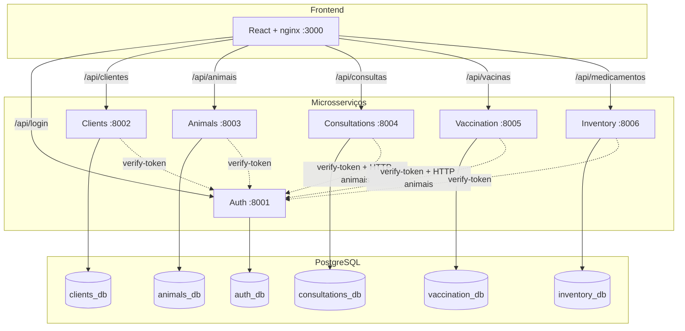
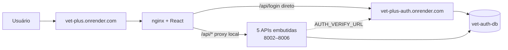
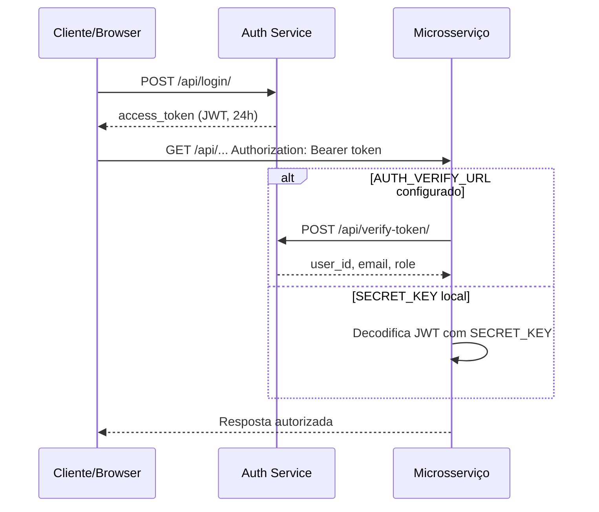

# Vet Plus+ — Sistema de Gerenciamento para Clínica Veterinária

Sistema distribuído para gestão de clínicas veterinárias, desenvolvido como projeto acadêmico de Engenharia de Software. Demonstra **Arquitetura Limpa**, **Microsserviços**, **SOLID**, **Design Patterns**, **TDD**, **BDD**, **Docker**, **API REST** com Swagger e **dashboard React** em produção.

**Produção:** [vet-plus.onrender.com](https://vet-plus.onrender.com)  
**Repositório:** [github.com/LuanaPZenha/vet-plus](https://github.com/LuanaPZenha/vet-plus)

---

## Sumário

- [Visão geral](#visão-geral)
- [Funcionalidades](#funcionalidades)
- [Arquitetura](#arquitetura)
- [Microsserviços](#microsserviços)
- [Frontend (Dashboard)](#frontend-dashboard)
- [Banco de dados](#banco-de-dados)
- [Autenticação e permissões](#autenticação-e-permissões)
- [Comunicação entre serviços](#comunicação-entre-serviços)
- [Design Patterns](#design-patterns)
- [Tecnologias](#tecnologias)
- [Estrutura do projeto](#estrutura-do-projeto)
- [Como executar](#como-executar)
- [Deploy no Render](#deploy-no-render)
- [API REST](#api-rest)
- [Variáveis de ambiente](#variáveis-de-ambiente)
- [Testes](#testes)
- [Documentação adicional](#documentação-adicional)
- [Segurança](#segurança)
- [Licença](#licença)

---

## Visão geral

O **Vet Plus+** é composto por **6 microsserviços backend** (Django REST) + **1 frontend** (React), cada um com responsabilidade única, banco de dados isolado (local) ou schema PostgreSQL isolado (produção), autenticação centralizada via JWT e integração HTTP entre domínios (animais ↔ consultas ↔ vacinas).

### Dois modos de execução

| Modo | Onde | Como funciona |
|------|------|----------------|
| **Desenvolvimento local** | `docker compose` | 6 APIs em containers separados + 6 PostgreSQL + frontend nginx na porta 3000 |
| **Produção (Render)** | Blueprint `render.yaml` | 2 serviços web: `vet-plus` (frontend + 5 APIs embutidas) e `vet-plus-auth` (login) + 1 PostgreSQL compartilhado com schemas |

---

## Funcionalidades

### Dashboard web (React)

| Página | Rota | Descrição |
|--------|------|-----------|
| **Login** | `/login` | Autenticação JWT |
| **Dashboard** | `/` | Resumo: tutores, animais, consultas, vacinas, estoque baixo |
| **Tutores** | `/clientes` | Cadastro e listagem de tutores (donos dos pets) |
| **Animais** | `/animais` | Cadastro de pets vinculados a tutores |
| **Veterinários** | `/veterinarios` | Cadastro de veterinários (usuário auth + perfil clínico) |
| **Consultas** | `/consultas` | Agendamento e conclusão de atendimentos |
| **Vacinas** | `/vacinas` | Registro vacinal, histórico e alertas de doses |
| **Estoque** | `/estoque` | Medicamentos, entradas/saídas, alerta de estoque baixo |

### Módulos backend

| Microsserviço | Responsabilidade |
|---------------|------------------|
| **Auth** | Registro, login, emissão e validação de JWT |
| **Clients** | CRUD de tutores (nome, CPF, e-mail, telefone, endereço) |
| **Animals** | CRUD de animais + histórico médico por pet |
| **Consultations** | Veterinários, agendamento, conclusão de consultas, cálculo de preço |
| **Vaccination** | Registro de vacinas, histórico por animal, lembretes de doses |
| **Inventory** | Medicamentos, movimentações de estoque, alertas de estoque mínimo |

---

## Arquitetura

### Clean Architecture (Arquitetura Limpa)

Cada microsserviço segue camadas com dependência **sempre apontando para dentro**:

```
src/
├── domain/              # Regras de negócio puras (sem Django/HTTP)
│   ├── entities/        # Entidades de domínio
│   ├── repositories/    # Interfaces (contratos) de persistência
│   ├── services/        # Serviços de domínio
│   └── patterns/        # Factory, Strategy, Observer, Facade
│
├── application/         # Orquestração
│   ├── use_cases/       # Casos de uso (1 classe = 1 fluxo)
│   └── dto/             # Data Transfer Objects
│
├── infrastructure/      # Implementações concretas
│   ├── database/        # Modelos ORM Django
│   ├── repositories/    # Django*Repository
│   └── services/        # Clientes HTTP (ex.: integração com Animais)
│
└── presentation/        # Interface externa
    └── api/
        ├── views/       # Endpoints REST (DRF APIView)
        ├── serializers/ # Validação entrada/saída JSON
        └── urls.py      # Rotas
```

| Camada | Depende de |
|--------|------------|
| Domain | Nada (núcleo) |
| Application | Domain |
| Infrastructure | Domain, Application |
| Presentation | Application |

### Diagrama — ambiente local (Docker Compose)



### Diagrama — produção (Render)



No Render, login/registro vão **direto** ao serviço de auth (evita erro 403/421 do Cloudflare). Demais APIs passam pelo nginx interno do container `vet-plus`.

---

## Microsserviços

| Serviço | Porta local | Banco local | Swagger local |
|---------|-------------|-------------|---------------|
| **Auth** | 8001 | auth_db | http://localhost:8001/api/docs/ |
| **Clients** | 8002 | clients_db | http://localhost:8002/api/docs/ |
| **Animals** | 8003 | animals_db | http://localhost:8003/api/docs/ |
| **Consultations** | 8004 | consultations_db | http://localhost:8004/api/docs/ |
| **Vaccination** | 8005 | vaccination_db | http://localhost:8005/api/docs/ |
| **Inventory** | 8006 | inventory_db | http://localhost:8006/api/docs/ |
| **Frontend** | 3000 | — | Dashboard web |

Cada serviço expõe schema OpenAPI em `/api/schema/` e UI Swagger em `/api/docs/`.

---

## Frontend (Dashboard)

Stack: **React 18**, **TypeScript**, **Vite**, **Tailwind CSS**, **React Router**, **Lucide Icons**.

### Estrutura principal

```
frontend/
├── src/
│   ├── api/client.ts       # Cliente HTTP unificado (JWT, proxy, Render)
│   ├── context/            # AuthContext, ToastContext
│   ├── components/         # Layout, Sidebar, Modal, Header, etc.
│   ├── pages/              # Uma página por módulo
│   └── types/              # Tipos TypeScript compartilhados
├── nginx.conf              # Proxy local (docker compose)
├── nginx.render.conf.template  # Proxy Render
├── docker-entrypoint.sh    # Startup Render (APIs + config.js)
└── start-api-services.sh   # Sobe 5 APIs embutidas no Render
```

### Comportamento da API no frontend

- **Desenvolvimento (`npm run dev`):** Vite faz proxy para `localhost:8001–8006`
- **Docker local:** nginx encaminha `/api/*` para containers dos microsserviços
- **Render:** `USE_API_PROXY: true` — caminhos relativos `/api/...`; login vai direto a `AUTH_URL`

Variável de runtime injetada em produção:

```javascript
window.__VET_PLUS_ENV__ = {
  USE_API_PROXY: true,
  AUTH_URL: "https://vet-plus-auth.onrender.com",
  BUILD_SHA: "<commit>"
};
```

---

## Banco de dados

### Local (Docker Compose)

Cada microsserviço tem **PostgreSQL 16 dedicado** (Database-per-Service).

| Container DB | Database | Microsserviço |
|--------------|----------|---------------|
| vet-auth-db | auth_db | Auth |
| vet-clients-db | clients_db | Clients |
| vet-animals-db | animals_db | Animals |
| vet-consultations-db | consultations_db | Consultations |
| vet-vaccination-db | vaccination_db | Vaccination |
| vet-inventory-db | inventory_db | Inventory |

Sem Docker, cada serviço usa **SQLite** (`db.sqlite3` na pasta do serviço).

### Produção (Render — plano free)

Um único PostgreSQL **`vet-auth-db`**, compartilhado por auth e APIs embutidas, com **schemas isolados** (evita conflito de `django_migrations`):

| Schema | Conteúdo |
|--------|----------|
| `public` | Usuários (auth) |
| `clients` | Tutores |
| `animals` | Animais e histórico médico |
| `consultations` | Veterinários e consultas |
| `vaccination` | Vacinas e lembretes |
| `inventory` | Medicamentos e movimentações |

O script `shared/prepare_postgres_schema.py` cria o schema antes das migrations no startup.

### Referências entre serviços

Não há foreign keys entre bancos. Relacionamentos usam **IDs inteiros** (`animal_id`, `client_id`, `veterinarian_id`, `user_id`) validados via **HTTP** quando necessário (ex.: vacina confirma que o animal existe antes de salvar).

---

## Autenticação e permissões

### Fluxo JWT



### Roles (papéis)

| Role | Acesso |
|------|--------|
| `admin` | Acesso total ao dashboard |
| `veterinarian` | Cadastros clínicos, consultas, vacinas |
| `tutor` | Visualiza apenas seus animais (`client_id` = `user_id`) |

### Usuário demo (criado automaticamente no deploy)

| Campo | Valor |
|-------|-------|
| E-mail | `admin@vet.com` |
| Senha | `senha1234` |
| Papel | `admin` |

Desativar: `SKIP_DEMO_USER=true` no serviço `vet-plus-auth`.

Também é criado automaticamente o veterinário demo **Dr. Admin Vet** (CRMV `SP-10001`) no serviço de consultas. Desativar: `SKIP_DEMO_VETERINARIAN=true`.

---

## Comunicação entre serviços

| Origem | Destino | Como | Para quê |
|--------|---------|------|----------|
| Todos (exceto auth) | Auth | `AUTH_VERIFY_URL` | Validar JWT |
| Consultations | Animals | `ANIMALS_SERVICE_URL` | Validar animal ao agendar/concluir consulta |
| Consultations | Animals | HTTP POST histórico | Registrar consulta no prontuário |
| Vaccination | Animals | `ANIMALS_SERVICE_URL` | Validar animal e registrar vacina no histórico |

Cliente HTTP compartilhado: `shared/animal_client.py` (`HttpAnimalService`, `HttpMedicalHistoryService`).

---

## Design Patterns

Implementados principalmente no microsserviço **Consultations**; detalhes em [docs/DESIGN_PATTERNS.md](docs/DESIGN_PATTERNS.md).

| Pattern | Onde | Uso |
|---------|------|-----|
| **Repository** | Todos os serviços | `I*Repository` → `Django*Repository` |
| **Factory Method** | Consultations | `MedicalRecordFactory` — tipos de registro médico |
| **Strategy** | Consultations | `PriceCalculationContext` — preço por tipo de consulta |
| **Observer** | Consultations | Notificações ao agendar consulta |
| **Observer** | Vaccination | `VaccineReminderObserver` — lembretes de doses |
| **Facade** | Consultations | `VeterinaryServiceFacade` — conclusão de consulta orquestrada |

---

## Tecnologias

### Backend

| Item | Tecnologia |
|------|------------|
| Linguagem | Python 3.13+ |
| Framework | Django 5.x + Django REST Framework |
| Banco | PostgreSQL 16 (prod/local) / SQLite (dev isolado) |
| Auth | JWT (PyJWT) |
| API Docs | drf-spectacular (OpenAPI 3 / Swagger) |
| Testes | Pytest, pytest-django, Behave (BDD) |
| Servidor | Gunicorn |

### Frontend

| Item | Tecnologia |
|------|------------|
| Framework | React 18 + TypeScript |
| Build | Vite 6 |
| Estilo | Tailwind CSS 3 |
| Roteamento | React Router 6 |
| Ícones | Lucide React |
| Servidor prod | nginx |

### Infraestrutura

| Item | Tecnologia |
|------|------------|
| Containers | Docker + Docker Compose |
| Deploy cloud | Render (Blueprint) |
| CI/CD | Git push → Render auto-deploy |

---

## Estrutura do projeto

```
vet-plus/
├── docker-compose.yml          # Stack completa local (6 DBs + 6 APIs + frontend)
├── Dockerfile                  # Render: frontend + 5 APIs embutidas
├── Dockerfile.auth             # Render: microsserviço de auth
├── render.yaml                 # Blueprint Render (vet-plus + vet-plus-auth + DB)
├── .env.example                # Variáveis de ambiente
│
├── shared/                     # Código compartilhado entre microsserviços
│   ├── django_settings.py      # Settings base Django
│   ├── jwt_auth.py             # JWTAuthentication + roles
│   ├── cors_middleware.py      # CORS para APIs
│   ├── animal_client.py        # Cliente HTTP → microsserviço Animais
│   └── prepare_postgres_schema.py  # Cria schema PostgreSQL no Render
│
├── frontend/                   # Dashboard React
│   ├── src/
│   ├── nginx.conf
│   ├── nginx.render.conf.template
│   ├── docker-entrypoint.sh
│   └── start-api-services.sh
│
├── services/
│   ├── auth/                   # Autenticação JWT
│   ├── clients/                # Tutores
│   ├── animals/                # Animais + histórico médico
│   ├── consultations/          # Consultas + veterinários + patterns
│   ├── vaccination/            # Vacinas + lembretes
│   └── inventory/              # Estoque de medicamentos
│
├── data/seed/                  # JSON para script de seed manual
│   ├── clients.json
│   ├── animals.json
│   ├── consultations.json
│   ├── vaccines.json
│   └── medicines.json
│
├── scripts/
│   └── seed_data.py            # Popula APIs via HTTP (ambiente local)
│
└── docs/                       # Documentação acadêmica detalhada
    ├── ARCHITECTURE.md
    ├── SOLID.md
    ├── DESIGN_PATTERNS.md
    ├── CLEAN_CODE.md
    ├── TDD_BDD.md
    ├── DEPLOY.md               # Deploy em Ubuntu/VPS
    └── RENDER.md               # Deploy no Render
```

Cada microsserviço em `services/<nome>/` segue a mesma estrutura:

```
services/<nome>/
├── config/           # settings.py, urls.py, wsgi.py
├── manage.py
├── Dockerfile
├── requirements.txt
├── pytest.ini
├── features/         # Cenários BDD (Behave) — onde aplicável
├── tests/
│   ├── unit/
│   └── integration/
└── src/
    ├── domain/
    ├── application/
    ├── infrastructure/
    └── presentation/
```

---

## Como executar

### Pré-requisitos

- [Docker Desktop](https://www.docker.com/products/docker-desktop/) (Windows/Mac) ou Docker + Compose (Linux)
- Node.js 20+ (apenas para desenvolvimento frontend local)
- Python 3.13+ (apenas para desenvolvimento backend local)

### Opção 1 — Docker Compose (recomendado)

```bash
# Clone o repositório
git clone https://github.com/LuanaPZenha/vet-plus.git
cd vet-plus

# Configure variáveis de ambiente
cp .env.example .env

# Suba toda a stack
docker compose up --build -d

# Verifique os containers
docker compose ps
```

**URLs após subir:**

| Recurso | URL |
|---------|-----|
| **Dashboard** | http://localhost:3000 |
| Auth API / Swagger | http://localhost:8001/api/docs/ |
| Clients Swagger | http://localhost:8002/api/docs/ |
| Animals Swagger | http://localhost:8003/api/docs/ |
| Consultations Swagger | http://localhost:8004/api/docs/ |
| Vaccination Swagger | http://localhost:8005/api/docs/ |
| Inventory Swagger | http://localhost:8006/api/docs/ |

**Login demo:** `admin@vet.com` / `senha1234`

```bash
# Parar a stack
docker compose down

# Parar e remover volumes (apaga dados)
docker compose down -v
```

### Opção 2 — Frontend em modo dev

Com a stack Docker rodando:

```bash
cd frontend
npm install
npm run dev
# http://localhost:5173 — proxy Vite para APIs em localhost:8001–8006
```

### Opção 3 — Seed manual de dados (local)

Com todos os serviços no ar:

```bash
python scripts/seed_data.py
```

Popula tutores, animais, consultas, vacinas e medicamentos via API REST usando os JSON em `data/seed/`.

### Opção 4 — Backend isolado (sem Docker)

```bash
cd services/auth
pip install -r requirements.txt
export PYTHONPATH=$PWD:$PWD/../../shared
python manage.py migrate
python manage.py runserver 8001
```

Repita para cada serviço nas portas 8002–8006, com PostgreSQL ou SQLite conforme `DATABASE_URL`.

---

## Deploy no Render

Documentação completa: [docs/RENDER.md](docs/RENDER.md)

### Resumo rápido

1. Conecte o repositório GitHub ao Blueprint Render (`render.yaml`)
2. **Manual sync** do Blueprint após cada push relevante
3. Serviços criados:
   - **vet-plus** — frontend + APIs embutidas (`Dockerfile`)
   - **vet-plus-auth** — autenticação (`Dockerfile.auth`)
   - **vet-auth-db** — PostgreSQL (plano free: 1 banco)

| URL | Função |
|-----|--------|
| https://vet-plus.onrender.com | App principal |
| https://vet-plus-auth.onrender.com | Auth + Swagger |

### Checklist pós-deploy

1. Login com `admin@vet.com` / `senha1234`
2. Console do browser: `window.__VET_PLUS_ENV__` deve mostrar `USE_API_PROXY: true` e `BUILD_SHA` recente
3. `SECRET_KEY` idêntica em **vet-plus** e **vet-plus-auth** (grupo `vet-shared` no blueprint)
4. Se deploy falhar: **Clear build cache & deploy** em ambos os serviços

### Plano free — limitações

- Hibernação após ~15 min sem uso (primeira requisição ~50s)
- Apenas **1 banco PostgreSQL** gratuito (schemas separam os microsserviços)

---

## API REST

Todas as rotas (exceto login/registro) exigem header:

```
Authorization: Bearer <access_token>
```

### Auth (`/api/`)

| Método | Endpoint | Descrição |
|--------|----------|-----------|
| POST | `/api/register/` | Registrar usuário |
| POST | `/api/login/` | Login → JWT |
| POST | `/api/verify-token/` | Validar token (microsserviços) |

### Clients — Tutores (`/api/clientes/`)

| Método | Endpoint | Descrição |
|--------|----------|-----------|
| GET | `/api/clientes/` | Listar tutores |
| POST | `/api/clientes/` | Criar tutor |
| GET | `/api/clientes/{id}/` | Detalhe do tutor |

### Animals — Animais (`/api/animais/`)

| Método | Endpoint | Descrição |
|--------|----------|-----------|
| GET | `/api/animais/` | Listar animais |
| POST | `/api/animais/` | Criar animal |
| GET | `/api/animais/{id}/` | Detalhe do animal |
| GET | `/api/animais/{id}/historico/` | Histórico médico |
| POST | `/api/animais/{id}/historico/` | Adicionar registro médico |

### Consultations — Consultas e Veterinários

| Método | Endpoint | Descrição |
|--------|----------|-----------|
| GET | `/api/consultas/` | Listar consultas |
| POST | `/api/consultas/` | Agendar consulta |
| GET | `/api/consultas/{id}/` | Detalhe da consulta |
| PATCH | `/api/consultas/{id}/concluir/` | Concluir atendimento (Facade) |
| GET | `/api/veterinarios/` | Listar veterinários |
| POST | `/api/veterinarios/` | Cadastrar veterinário |

### Vaccination — Vacinas (`/api/vacinas/`)

| Método | Endpoint | Descrição |
|--------|----------|-----------|
| GET | `/api/vacinas/` | Listar vacinas |
| POST | `/api/vacinas/` | Registrar vacina |
| GET | `/api/vacinas/{id}/` | Detalhe da vacina |
| GET | `/api/vacinas/animal/{animal_id}/` | Histórico vacinal do animal |
| GET | `/api/vacinas/proximas/` | Doses próximas do vencimento |

### Inventory — Estoque (`/api/medicamentos/`)

| Método | Endpoint | Descrição |
|--------|----------|-----------|
| GET | `/api/medicamentos/` | Listar medicamentos |
| POST | `/api/medicamentos/` | Cadastrar medicamento |
| GET | `/api/medicamentos/{id}/` | Detalhe |
| GET | `/api/medicamentos/baixo-estoque/` | Itens abaixo do mínimo |
| GET | `/api/medicamentos/movimentacoes/` | Histórico de movimentações |
| POST | `/api/medicamentos/{id}/entrada/` | Entrada de estoque |
| POST | `/api/medicamentos/{id}/saida/` | Saída de estoque |

### Exemplos curl

```bash
# Login
curl -X POST http://localhost:8001/api/login/ \
  -H "Content-Type: application/json" \
  -d '{"email":"admin@vet.com","password":"senha1234"}'

# Listar tutores (substitua TOKEN)
curl -H "Authorization: Bearer TOKEN" http://localhost:8002/api/clientes/

# Criar animal
curl -X POST http://localhost:8003/api/animais/ \
  -H "Authorization: Bearer TOKEN" \
  -H "Content-Type: application/json" \
  -d '{"name":"Rex","species":"Cão","breed":"Labrador","client_id":1}'

# Agendar consulta
curl -X POST http://localhost:8004/api/consultas/ \
  -H "Authorization: Bearer TOKEN" \
  -H "Content-Type: application/json" \
  -d '{"animal_id":1,"veterinarian_id":1,"scheduled_at":"2026-06-20T10:00:00Z","type":"regular"}'

# Registrar vacina
curl -X POST http://localhost:8005/api/vacinas/ \
  -H "Authorization: Bearer TOKEN" \
  -H "Content-Type: application/json" \
  -d '{"animal_id":1,"vaccine_name":"V10","application_date":"2026-01-10","veterinarian_id":1}'
```

---

## Variáveis de ambiente

### Globais (`.env` / docker compose)

| Variável | Descrição | Padrão |
|----------|-----------|--------|
| `SECRET_KEY` | Chave JWT Django (mesma em todos os serviços) | — |
| `DB_PASSWORD` | Senha PostgreSQL | `vet_secret_2024` |
| `DEBUG` | Modo debug Django | `False` |
| `ALLOWED_HOSTS` | Hosts permitidos | `localhost,127.0.0.1` |

### Auth

| Variável | Descrição |
|----------|-----------|
| `DATABASE_URL` | PostgreSQL ou SQLite |
| `SKIP_DEMO_USER` | `true` desativa usuário demo |

### Microsserviços (clients, animals, etc.)

| Variável | Descrição |
|----------|-----------|
| `DATABASE_URL` | PostgreSQL ou SQLite |
| `AUTH_VERIFY_URL` | URL do endpoint verify-token (ex.: `http://auth-service:8000/api/verify-token/`) |
| `ANIMALS_SERVICE_URL` | URL do serviço de animais (consultations, vaccination) |

### Consultations

| Variável | Descrição |
|----------|-----------|
| `DEMO_VET_USER_ID` | user_id do veterinário demo | `1` |
| `SKIP_DEMO_VETERINARIAN` | `true` desativa vet demo |

### Render (automático via blueprint)

| Variável | Serviço | Descrição |
|----------|---------|-----------|
| `AUTH_URL` | vet-plus | URL externa do auth |
| `AUTH_HOST` | vet-plus | Host header para proxy |
| `DATABASE_URL` | ambos | Connection string `vet-auth-db` |

---

## Testes

### Pytest (TDD) — unitário e integração

```bash
# Um serviço
cd services/consultations
PYTHONPATH=$PWD:$PWD/../../shared pytest tests/ -v

# Todos os serviços (Linux/Mac)
for dir in services/*/; do
  echo "=== $dir ==="
  (cd "$dir" && PYTHONPATH=$PWD:$PWD/../../shared pytest tests/ -v --tb=short)
done
```

### Behave (BDD)

```bash
cd services/consultations
behave features/

cd services/animals
behave features/

cd services/vaccination
behave features/
```

### Cenários BDD implementados

| Serviço | Feature | Cenários |
|---------|---------|----------|
| Consultations | `appointment_scheduling.feature` | Agendar, falha sem vet, falha sem auth |
| Animals | `animal_registration.feature` | Cadastro de animal |
| Vaccination | `vaccination_control.feature` | Registrar vacina, histórico, doses próximas |
| Clients | `client_registration.feature` | Cadastro de tutor |

---

## Documentação adicional

| Documento | Conteúdo |
|-----------|----------|
| [docs/ARCHITECTURE.md](docs/ARCHITECTURE.md) | Arquitetura Limpa e microsserviços em profundidade |
| [docs/SOLID.md](docs/SOLID.md) | Princípios SOLID com exemplos do código |
| [docs/DESIGN_PATTERNS.md](docs/DESIGN_PATTERNS.md) | Factory, Strategy, Repository, Facade, Observer |
| [docs/CLEAN_CODE.md](docs/CLEAN_CODE.md) | Boas práticas de código limpo |
| [docs/TDD_BDD.md](docs/TDD_BDD.md) | Test Driven Development e BDD |
| [docs/DEPLOY.md](docs/DEPLOY.md) | Deploy em Ubuntu Server / VPS |
| [docs/RENDER.md](docs/RENDER.md) | Deploy no Render (produção atual) |

---

## Segurança

- **JWT** com expiração de 24 horas
- **Senhas** com hash PBKDF2 (`set_password`)
- **Roles** (`admin`, `veterinarian`, `tutor`) em todos os endpoints protegidos
- **Validação de token** via `AUTH_VERIFY_URL` em produção (SECRET_KEY compartilhada entre auth e APIs)
- **CORS** configurado via `shared/cors_middleware.py`
- **Variáveis sensíveis** via `.env` / Render Environment (nunca commitar secrets)
- Login/registro no Render vão **direto** ao auth (sem proxy intermediário)

---

## Licença

Projeto acadêmico — uso educacional.

---

## Autora

**Luana Zenha** — [github.com/LuanaPZenha/vet-plus](https://github.com/LuanaPZenha/vet-plus)
