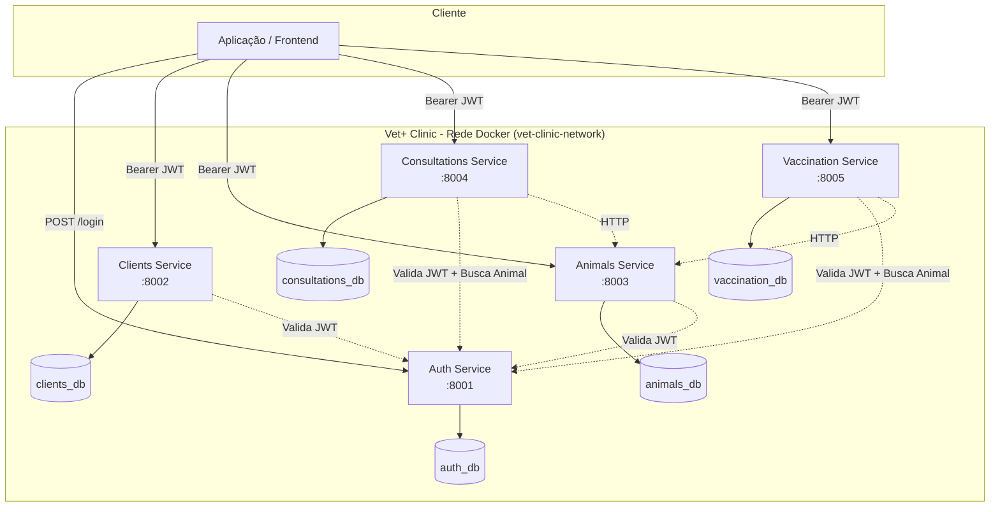
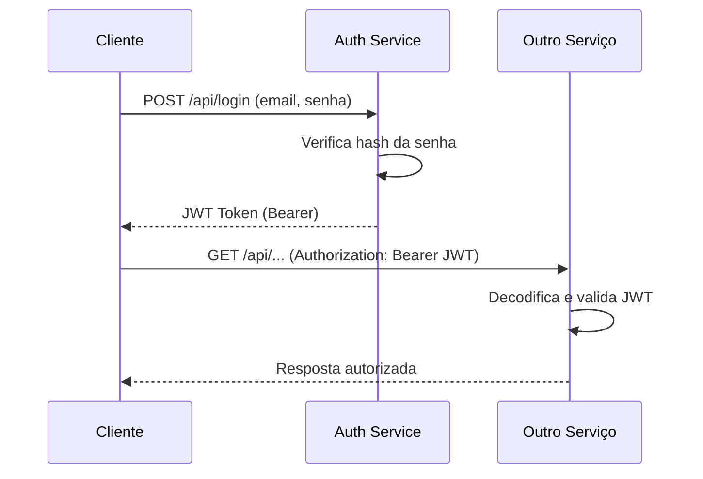

# Vet+ Clinic — Sistema de Gerenciamento para Clínica Veterinária

Projeto acadêmico de Engenharia de Software demonstrando **Arquitetura Limpa**, **Microsserviços**, **SOLID**, **Design Patterns**, **TDD**, **BDD**, **Docker** e **API REST** com documentação Swagger.

---

## Sumário

- [Visão Geral](#visão-geral)
- [Arquitetura](#arquitetura)
- [Microsserviços](#microsserviços)
- [Tecnologias](#tecnologias)
- [Estrutura de Diretórios](#estrutura-de-diretórios)
- [Como Executar](#como-executar)
- [API REST](#api-rest)
- [Testes](#testes)
- [Documentação Adicional](#documentação-adicional)

---

## Visão Geral

O **Vet+ Clinic** é um sistema distribuído para gerenciamento de clínicas veterinárias, composto por **5 microsserviços independentes**, cada um com banco PostgreSQL próprio, API REST documentada e testes automatizados.

### Funcionalidades

| Módulo | Funcionalidade |
|--------|----------------|
| Autenticação | Login, registro, JWT, controle de permissões |
| Clientes | Cadastro de tutores |
| Animais | Cadastro de pets e histórico médico |
| Consultas | Agendamento, atendimento, cálculo de preços |
| Vacinação | Controle vacinal e lembretes |

---

## Arquitetura

### Clean Architecture (Arquitetura Limpa)

Cada microsserviço segue a separação em camadas:

```
src/
├── domain/           # Regras de negócio puras (sem dependências externas)
│   ├── entities/     # Entidades de domínio
│   ├── repositories/ # Interfaces (contratos) de persistência
│   └── services/     # Serviços de domínio
│
├── application/      # Orquestração de casos de uso
│   ├── use_cases/    # Casos de uso da aplicação
│   └── dto/          # Objetos de transferência de dados
│
├── infrastructure/   # Implementações concretas
│   ├── database/     # Modelos ORM (Django)
│   ├── repositories/ # Implementação dos repositórios
│   └── external_services/  # Comunicação HTTP entre serviços
│
└── presentation/     # Interface com o mundo externo
    ├── api/          # Views, URLs, autenticação
    ├── serializers/  # Serialização REST
    └── views/        # Endpoints HTTP
```

#### Função de cada camada

| Camada | Responsabilidade | Dependências |
|--------|------------------|--------------|
| **Domain** | Entidades, regras de negócio, interfaces | Nenhuma (camada mais interna) |
| **Application** | Casos de uso, coordenação de fluxos | Domain |
| **Infrastructure** | Banco de dados, HTTP, filas | Domain, Application |
| **Presentation** | API REST, serializers, autenticação | Application |

> A regra de dependência aponta **sempre para dentro**: Presentation → Application → Domain.

### Diagrama de Microsserviços



### Fluxo de Autenticação



---

## Microsserviços

| Serviço | Porta | Banco | Endpoints principais |
|---------|-------|-------|---------------------|
| **Auth** | 8001 | auth_db | POST /api/login, POST /api/register |
| **Clients** | 8002 | clients_db | GET/POST /api/clientes |
| **Animals** | 8003 | animals_db | GET/POST /api/animais |
| **Consultations** | 8004 | consultations_db | GET/POST /api/consultas |
| **Vaccination** | 8005 | vaccination_db | GET/POST /api/vacinas |

### Frontend Dashboard

| Serviço | Porta | Descrição |
|---------|-------|-----------|
| **Frontend** | 3000 | Dashboard web da clínica |

Cada serviço expõe documentação Swagger em `/api/docs/`.

---

## Tecnologias

| Categoria | Tecnologia |
|-----------|------------|
| Linguagem | Python 3.13+ |
| Framework | Django 5.x + Django REST Framework |
| Banco de Dados | PostgreSQL 16 |
| Containerização | Docker + Docker Compose |
| Testes Unitários/Integração | Pytest + pytest-django |
| Testes BDD | Behave |
| Documentação API | drf-spectacular (OpenAPI/Swagger) |
| Autenticação | JWT (PyJWT) |

---

## Estrutura de Diretórios

```
Vet+/
├── docker-compose.yml          # Orquestração de todos os serviços
├── .env.example                # Variáveis de ambiente
├── shared/                     # Utilitários compartilhados (JWT, settings)
├── docs/                       # Documentação acadêmica detalhada
│   ├── ARCHITECTURE.md
│   ├── SOLID.md
│   ├── DESIGN_PATTERNS.md
│   ├── CLEAN_CODE.md
│   └── DEPLOY.md
└── services/
    ├── auth/
    ├── clients/
    ├── animals/
    ├── consultations/
    └── vaccination/
```

---

## Como Executar

### Pré-requisitos

- Docker Desktop (Windows/Mac) ou Docker + Docker Compose (Linux)
- Python 3.13+ (para desenvolvimento local)

### Via Docker Compose (recomendado)

```bash
# 1. Clone e entre no diretório
cd Vet+

# 2. Configure variáveis de ambiente
cp .env.example .env

# 3. Suba todos os serviços
docker compose up --build -d

# 4. Verifique status
docker compose ps
```

### URLs após subir

| Serviço | URL |
|---------|-----|
| **Dashboard (Frontend)** | http://localhost:3000 |
| Auth API | http://localhost:8001/api/ |
| Auth Swagger | http://localhost:8001/api/docs/ |
| Clients Swagger | http://localhost:8002/api/docs/ |
| Animals Swagger | http://localhost:8003/api/docs/ |
| Consultations Swagger | http://localhost:8004/api/docs/ |
| Vaccination Swagger | http://localhost:8005/api/docs/ |

### Frontend (desenvolvimento local)

```bash
cd frontend
npm install
npm run dev
# Acesse http://localhost:3000 (proxy automático para APIs)
```

### Desenvolvimento local (sem Docker)

```bash
cd services/auth
pip install -r requirements.txt
python manage.py migrate
python manage.py runserver 8001
```

Repita para cada serviço nas portas 8001–8005.

---

## API REST

### Autenticação

```bash
# Registrar usuário
curl -X POST http://localhost:8001/api/register/ \
  -H "Content-Type: application/json" \
  -d '{"email":"vet@clinica.com","password":"senha1234","full_name":"Dr. Silva","role":"veterinarian"}'

# Login
curl -X POST http://localhost:8001/api/login/ \
  -H "Content-Type: application/json" \
  -d '{"email":"vet@clinica.com","password":"senha1234"}'
```

Use o `access_token` retornado em todas as demais requisições:

```bash
curl -H "Authorization: Bearer <TOKEN>" http://localhost:8002/api/clientes/
```

### Endpoints principais

| Método | Endpoint | Serviço | Descrição |
|--------|----------|---------|-----------|
| POST | /api/register | Auth | Registrar usuário |
| POST | /api/login | Auth | Login JWT |
| GET/POST | /api/clientes | Clients | Listar/criar tutores |
| GET/POST | /api/animais | Animals | Listar/criar animais |
| GET/POST | /api/consultas | Consultations | Listar/agendar consultas |
| PATCH | /api/consultas/{id}/concluir | Consultations | Concluir atendimento |
| GET/POST | /api/vacinas | Vaccination | Listar/registrar vacinas |
| GET | /api/vacinas/proximas | Vaccination | Vacinas próximas do vencimento |

---

## Testes

### Pytest (TDD)

```bash
# Executar testes de um serviço
cd services/consultations
pytest tests/ -v

# Executar todos os serviços
for dir in services/*/; do
  echo "=== $dir ==="
  (cd "$dir" && pytest tests/ -v --tb=short)
done
```

### Behave (BDD)

```bash
cd services/consultations
behave features/

cd services/vaccination
behave features/
```

### Cenários BDD implementados

**Agendamento de consulta** (`services/consultations/features/`):
- Agendar consulta com sucesso
- Falha sem veterinário disponível
- Falha sem autenticação

**Controle de vacinação** (`services/vaccination/features/`):
- Registrar vacina no histórico
- Listar vacinas de um animal
- Consultar vacinas próximas do vencimento

---

## Documentação Adicional

| Documento | Conteúdo |
|-----------|----------|
| [docs/ARCHITECTURE.md](docs/ARCHITECTURE.md) | Arquitetura Limpa e microsserviços em detalhe |
| [docs/SOLID.md](docs/SOLID.md) | Princípios SOLID com exemplos do código |
| [docs/DESIGN_PATTERNS.md](docs/DESIGN_PATTERNS.md) | Factory, Strategy, Repository, Facade, Observer |
| [docs/CLEAN_CODE.md](docs/CLEAN_CODE.md) | Boas práticas de código limpo aplicadas |
| [docs/DEPLOY.md](docs/DEPLOY.md) | Guia completo de deploy em Ubuntu Server |
| [docs/TDD_BDD.md](docs/TDD_BDD.md) | Test Driven Development e Behavior Driven Development |

---

## Segurança

- **JWT**: Tokens com expiração de 24h
- **Hash de senhas**: Django `set_password` (PBKDF2)
- **Controle de permissões**: Roles (`admin`, `veterinarian`, `tutor`)
- **Variáveis de ambiente**: `SECRET_KEY`, `DB_PASSWORD` via `.env`
- **Proteção de endpoints**: Autenticação JWT obrigatória (exceto login/register)

---

## Licença

Projeto acadêmico — uso educacional.
