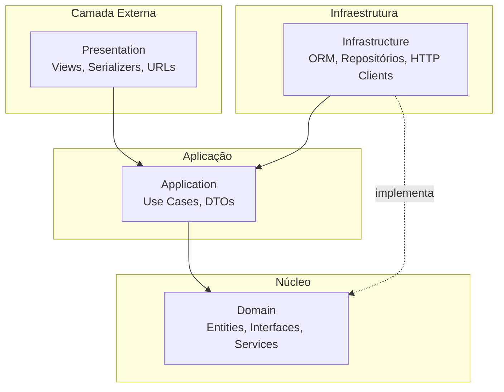
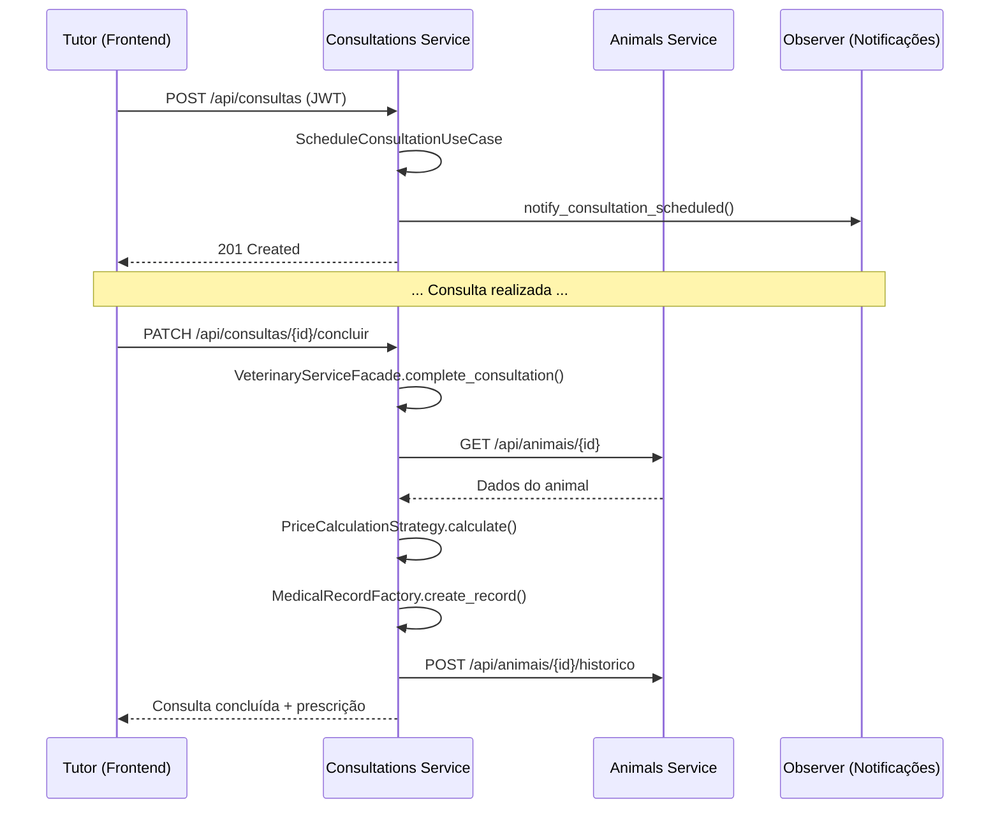

# Arquitetura — Vet+ Clinic

## 1. Arquitetura Limpa (Clean Architecture)

A Arquitetura Limpa, proposta por Robert C. Martin (Uncle Bob), organiza o software em camadas concêntricas onde **as dependências apontam sempre para o centro**. O domínio de negócio fica no núcleo, isolado de frameworks, banco de dados e interfaces externas.

### 1.1 Diagrama de Camadas



### 1.2 Detalhamento de cada camada

#### Domain (Domínio)

**Localização:** `src/domain/`

**Responsabilidade:** Contém as regras de negócio puras. Não depende de Django, PostgreSQL ou qualquer framework.

| Subpasta | Conteúdo | Exemplo |
|----------|----------|---------|
| `entities/` | Objetos de negócio com comportamento | `Consultation`, `Animal`, `User` |
| `repositories/` | Interfaces (ABC) para persistência | `IConsultationRepository` |
| `services/` | Lógica de domínio transversal | `TokenService` |
| `patterns/` | Design Patterns de domínio | `MedicalRecordFactory`, `PriceCalculationStrategy` |

**Exemplo — Entidade de domínio pura:**

```python
@dataclass
class Consultation:
    id: int | None
    animal_id: int
    veterinarian_id: int
    scheduled_at: datetime
    status: ConsultationStatus
    type: ConsultationType

    def is_cancellable(self) -> bool:
        return self.status == ConsultationStatus.SCHEDULED
```

#### Application (Aplicação)

**Localização:** `src/application/`

**Responsabilidade:** Orquestra os casos de uso. Recebe DTOs, chama repositórios e serviços de domínio, retorna resultados.

| Subpasta | Conteúdo | Exemplo |
|----------|----------|---------|
| `use_cases/` | Um caso de uso por classe | `ScheduleConsultationUseCase` |
| `dto/` | Objetos de transferência | `CreateConsultationDTO` |

**Exemplo — Caso de uso:**

```python
class ScheduleConsultationUseCase:
    def __init__(self, consultation_repository, notification_subject):
        self._repository = consultation_repository
        self._notifications = notification_subject

    def execute(self, dto: CreateConsultationDTO) -> Consultation:
        consultation = Consultation(...)
        saved = self._repository.save(consultation)
        self._notifications.notify_consultation_scheduled(saved)
        return saved
```

#### Infrastructure (Infraestrutura)

**Localização:** `src/infrastructure/`

**Responsabilidade:** Implementações concretas de interfaces definidas no domínio. Aqui vive o Django ORM, PostgreSQL e clientes HTTP.

| Subpasta | Conteúdo | Exemplo |
|----------|----------|---------|
| `database/` | Modelos Django ORM | `ConsultationModel` |
| `repositories/` | Implementação dos repositórios | `DjangoConsultationRepository` |
| `services/` | Clientes HTTP para outros microsserviços | `HttpAnimalService` |

**Exemplo — Repository concreto:**

```python
class DjangoConsultationRepository(IConsultationRepository):
    def save(self, consultation: Consultation) -> Consultation:
        model = ConsultationModel.objects.create(...)
        return self._to_entity(model)
```

#### Presentation (Apresentação)

**Localização:** `src/presentation/`

**Responsabilidade:** Interface HTTP (REST API). Serializa/deserializa JSON, valida entrada, chama casos de uso.

| Subpasta | Conteúdo | Exemplo |
|----------|----------|---------|
| `api/views/` | Endpoints REST | `ConsultationListCreateView` |
| `api/serializers/` | Validação de entrada/saída | `ConsultationSerializer` |
| `api/authentication/` | JWT middleware | `JWTAuthentication` |

---

## 2. Arquitetura de Microsserviços

### 2.1 Princípios aplicados

| Princípio | Implementação |
|-----------|---------------|
| **Database per Service** | Cada serviço possui PostgreSQL próprio |
| **API Gateway implícito** | Cliente consome APIs diretamente (sem gateway central) |
| **Comunicação síncrona** | HTTP REST entre serviços |
| **Autenticação centralizada** | Auth Service emite JWT; demais validam localmente |
| **Deploy independente** | Cada serviço tem Dockerfile e pode ser atualizado isoladamente |

### 2.2 Mapa de comunicação

```mermaid
graph LR
    subgraph Auth["Auth :8001"]
        JWT[Geração JWT]
    end

    subgraph Clients["Clients :8002"]
        CRUD_C[CRUD Tutores]
    end

    subgraph Animals["Animals :8003"]
        CRUD_A[CRUD Animais]
        HIST[Histórico Médico]
    end

    subgraph Consultations["Consultations :8004"]
        AGEND[Agendamento]
        ATEND[Atendimento]
        FACADE[VeterinaryServiceFacade]
    end

    subgraph Vaccination["Vaccination :8005"]
        VAC[Controle Vacinal]
        REM[Lembretes]
    end

    Consultations -->|GET /animais/{id}| Animals
    Consultations -->|POST /historico| Animals
    Vaccination -->|GET /animais/{id}| Animals

    Clients -.->|Valida JWT| Auth
    Animals -.->|Valida JWT| Auth
    Consultations -.->|Valida JWT| Auth
    Vaccination -.->|Valida JWT| Auth
```

### 2.3 Isolamento de dados

Cada microsserviço mantém referências externas por **ID** (não por foreign key cross-database):

- `Animal.client_id` → referência ao tutor no Clients Service
- `Consultation.animal_id` → referência ao animal no Animals Service
- `Vaccine.animal_id` → referência ao animal no Animals Service

Isso garante **desacoplamento** entre serviços, permitindo evolução independente.

---

## 3. Infraestrutura Docker

### 3.1 Rede

Todos os containers compartilham a rede bridge `vet-clinic-network`, permitindo resolução DNS por nome de serviço (`auth-service`, `animals-service`, etc.).

### 3.2 Volumes

Cada banco PostgreSQL possui volume persistente (`auth_db_data`, `clients_db_data`, etc.), garantindo que dados sobrevivam a restarts de containers.

### 3.3 Health Checks

Os bancos PostgreSQL possuem health checks (`pg_isready`) que garantem que os microsserviços só iniciem após o banco estar pronto.

---

## 4. Fluxo completo: Agendamento e Conclusão de Consulta


