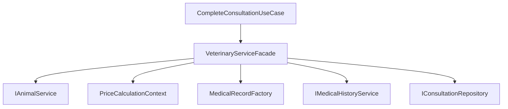

# Design Patterns — Vet+ Clinic

Este documento detalha cada Design Pattern implementado no projeto, com explicação conceitual, localização no código e exemplos.

---

## 1. Factory Method — MedicalRecordFactory

### Conceito

O **Factory Method** define uma interface para criar objetos, delegando às subclasses (ou métodos especializados) a decisão de qual classe concreta instanciar.

### Problema resolvido

Ao concluir uma consulta, o sistema precisa criar diferentes tipos de registros médicos (consulta, vacinação, cirurgia) com campos específicos. Sem o Factory, o código cliente teria `if/elif/else` espalhados.

### Estrutura

```
MedicalRecord (produto abstrato)
├── ConsultationRecord (produto concreto)
├── VaccinationRecord (produto concreto)
└── SurgeryRecord (produto concreto)

MedicalRecordFactory (criador)
├── create_consultation_record()
├── create_vaccination_record()
├── create_surgery_record()
└── create_record_for_consultation()  ← factory method polimórfico
```

### Localização

`services/consultations/src/domain/patterns/factory/medical_record_factory.py`

### Código

```python
class MedicalRecordFactory:
    @staticmethod
    def create_consultation_record(animal_id, description, diagnosis=""):
        return ConsultationRecord(
            animal_id=animal_id,
            description=description,
            record_type="consultation",
            diagnosis=diagnosis,
        )

    @staticmethod
    def create_surgery_record(animal_id, description, procedure="", anesthesia_type=""):
        return SurgeryRecord(
            animal_id=animal_id,
            description=description,
            record_type="surgery",
            procedure=procedure,
            anesthesia_type=anesthesia_type,
        )

    @classmethod
    def create_record_for_consultation(cls, consultation_type, animal_id, description, ...):
        if consultation_type == ConsultationType.SURGERY:
            return cls.create_surgery_record(animal_id, description, ...)
        return cls.create_consultation_record(animal_id, description, ...)
```

### Uso no Facade

```python
# VeterinaryServiceFacade usa o Factory sem conhecer classes concretas
record = self._record_factory.create_record_for_consultation(
    consultation_type=consultation.type,
    animal_id=consultation.animal_id,
    description=diagnosis,
)
```

---

## 2. Strategy — Cálculo de Preços

### Conceito

O **Strategy** define uma família de algoritmos intercambiáveis. Cada estratégia encapsula um algoritmo diferente, permitindo trocá-lo em tempo de execução.

### Problema resolvido

Consultas regulares, de emergência e cirurgias possuem regras de preço distintas. O Strategy evita condicionais extensos e permite adicionar novos tipos sem modificar código existente (OCP).

### Estrutura

```
PriceCalculationStrategy (estratégia abstrata)
├── RegularConsultationStrategy    → R$ 150,00
├── EmergencyConsultationStrategy  → R$ 300,00 (2x)
└── SurgeryStrategy                → R$ 800,00

PriceCalculationContext (contexto)
└── calculate_price(consultation) → delega à estratégia
```

### Localização

`services/consultations/src/domain/patterns/strategy/price_calculation.py`

### Código

```python
class PriceCalculationStrategy(ABC):
    @abstractmethod
    def calculate(self, consultation: Consultation) -> float: ...

class EmergencyConsultationStrategy(PriceCalculationStrategy):
    BASE_PRICE = 150.00
    EMERGENCY_MULTIPLIER = 2.0

    def calculate(self, consultation: Consultation) -> float:
        return round(self.BASE_PRICE * self.EMERGENCY_MULTIPLIER, 2)

class PriceCalculationContext:
    _strategies = {
        ConsultationType.REGULAR: RegularConsultationStrategy(),
        ConsultationType.EMERGENCY: EmergencyConsultationStrategy(),
        ConsultationType.SURGERY: SurgeryStrategy(),
    }

    def calculate_price(self, consultation: Consultation) -> float:
        strategy = self._strategies.get(consultation.type, RegularConsultationStrategy())
        return strategy.calculate(consultation)
```

### Teste TDD

```python
def test_emergency_consultation_price():
    strategy = EmergencyConsultationStrategy()
    consultation = Consultation(type=ConsultationType.EMERGENCY, ...)
    assert strategy.calculate(consultation) == 300.00
```

---

## 3. Repository — Abstração de Persistência

### Conceito

O **Repository** abstrai a lógica de acesso a dados, fornecendo uma interface orientada a coleções de entidades de domínio. O domínio não conhece detalhes de ORM ou SQL.

### Problema resolvido

Casos de uso não devem depender de Django ORM diretamente. O Repository permite trocar PostgreSQL por outro banco ou usar repositórios in-memory em testes.

### Estrutura

```
IConsultationRepository (interface)
└── DjangoConsultationRepository (implementação Django ORM)

IUserRepository (interface)
└── DjangoUserRepository (implementação Django ORM)
```

### Localização

- Interfaces: `src/domain/repositories/`
- Implementações: `src/infrastructure/repositories/`

### Código

```python
# Interface (Domain)
class IConsultationRepository(ABC):
    @abstractmethod
    def save(self, consultation: Consultation) -> Consultation: ...
    @abstractmethod
    def find_by_id(self, consultation_id: int) -> Consultation | None: ...

# Implementação (Infrastructure)
class DjangoConsultationRepository(IConsultationRepository):
    def save(self, consultation: Consultation) -> Consultation:
        model = ConsultationModel.objects.create(
            animal_id=consultation.animal_id,
            veterinarian_id=consultation.veterinarian_id,
            scheduled_at=consultation.scheduled_at,
            status=consultation.status.value,
            type=consultation.type.value,
        )
        return self._to_entity(model)

    def _to_entity(self, model: ConsultationModel) -> Consultation:
        return Consultation(
            id=model.id,
            animal_id=model.animal_id,
            ...
        )
```

---

## 4. Facade — VeterinaryServiceFacade

### Conceito

O **Facade** fornece uma interface unificada e simplificada para um conjunto de interfaces de subsistemas complexos. Esconde a complexidade de orquestração.

### Problema resolvido

Concluir uma consulta envolve: buscar animal, calcular preço, criar registro médico, atualizar histórico, gerar prescrição e persistir. Sem Facade, o use case teria dezenas de linhas coordenando subsistemas.

### Subsistemas coordenados

1. `IAnimalService` — busca dados do animal
2. `PriceCalculationContext` — calcula preço (Strategy)
3. `MedicalRecordFactory` — cria registro (Factory Method)
4. `IMedicalHistoryService` — persiste no histórico
5. `IConsultationRepository` — atualiza consulta

### Localização

`services/consultations/src/domain/patterns/facade/veterinary_service_facade.py`

### Código

```python
class VeterinaryServiceFacade:
    def __init__(self, animal_service, medical_history_service,
                 consultation_repository, record_factory, price_context):
        self._animal_service = animal_service
        self._medical_history_service = medical_history_service
        self._consultation_repository = consultation_repository
        self._record_factory = record_factory or MedicalRecordFactory()
        self._price_context = price_context or PriceCalculationContext()

    def complete_consultation(self, consultation, diagnosis, prescription_notes=""):
        # 1. Buscar animal
        animal = self._animal_service.get_animal(consultation.animal_id)

        # 2. Calcular preço (Strategy)
        price = self._price_context.calculate_price(consultation)
        consultation.price = price

        # 3. Criar registro médico (Factory Method)
        record = self._record_factory.create_record_for_consultation(
            consultation_type=consultation.type,
            animal_id=consultation.animal_id,
            description=diagnosis,
        )

        # 4. Atualizar histórico
        self._medical_history_service.add_entry(animal.id, record.to_history_description())

        # 5. Gerar prescrição e persistir
        prescription = self._generate_prescription(animal.name, diagnosis, prescription_notes)
        consultation.status = ConsultationStatus.COMPLETED
        self._consultation_repository.update(consultation)

        return ConsultationCompletionResult(...)
```

### Diagrama



---

## 5. Observer — Notificações Automáticas

### Conceito

O **Observer** define uma dependência um-para-muitos: quando o estado do Subject muda, todos os Observers registrados são notificados automaticamente.

### Problema resolvido

Ao agendar uma consulta, múltiplos sistemas precisam reagir (e-mail, push, log, lembrete). O Observer desacopla quem emite o evento de quem reage.

### Estrutura

```
NotificationSubject (subject)
├── attach(observer)
├── detach(observer)
└── notify(event)

NotificationObserver (observer abstrato)
├── ConsultationScheduledObserver  → registra notificação
├── EmailNotificationObserver      → simula envio de e-mail
└── AppointmentReminderObserver    → agenda lembrete
```

### Localização

- Consultas: `services/consultations/src/domain/patterns/observer/`
- Vacinação: `services/vaccination/src/domain/observer/`

### Código — Consultas

```python
class NotificationSubject:
    def __init__(self):
        self._observers: list[NotificationObserver] = []

    def attach(self, observer: NotificationObserver) -> None:
        self._observers.append(observer)

    def notify(self, event: NotificationEvent) -> None:
        for observer in self._observers:
            observer.update(event)

    def notify_consultation_scheduled(self, consultation: Consultation) -> None:
        event = NotificationEvent(
            event_type="consultation_scheduled",
            consultation_id=consultation.id,
            animal_id=consultation.animal_id,
            message=f"Consulta agendada para {consultation.scheduled_at}",
        )
        self.notify(event)
```

### Código — Vacinação

```python
class VaccineReminderObserver:
    def check_upcoming_vaccines(self, vaccines: list[Vaccine], notification_service):
        for vaccine in vaccines:
            if vaccine.next_dose_date and vaccine.is_due_within(days=7):
                notification_service.send(
                    f"Vacina {vaccine.vaccine_name} do animal {vaccine.animal_id} "
                    f"vence em {vaccine.next_dose_date}"
                )
```

### Uso no agendamento

```python
class ScheduleConsultationUseCase:
    def __init__(self, repository, notification_subject):
        self._repository = repository
        self._notifications = notification_subject

    def execute(self, dto):
        consultation = self._repository.save(...)
        self._notifications.notify_consultation_scheduled(consultation)
        return consultation
```

---

## Resumo dos Patterns

| Pattern | Serviço | Arquivo principal | Propósito |
|---------|---------|-------------------|-----------|
| Factory Method | Consultations | `medical_record_factory.py` | Criar registros médicos por tipo |
| Strategy | Consultations | `price_calculation.py` | Calcular preço por tipo de consulta |
| Repository | Todos | `domain/repositories/` | Abstrair acesso a dados |
| Facade | Consultations | `veterinary_service_facade.py` | Orquestrar conclusão de consulta |
| Observer | Consultations + Vaccination | `notification_subject.py` | Notificações automáticas |
