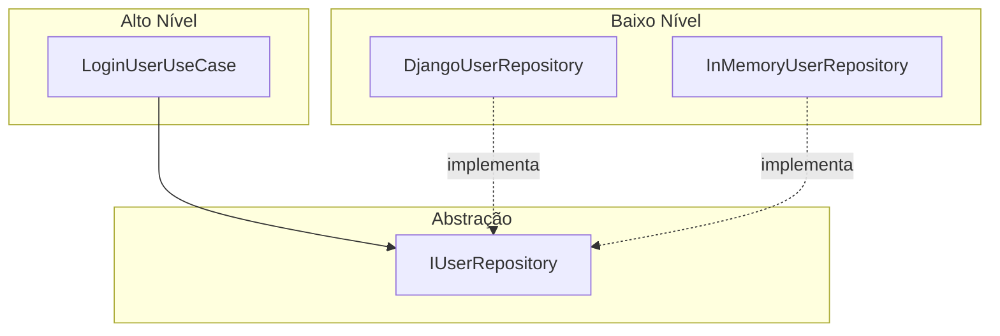

# Princípios SOLID — Vet+ Clinic

Este documento explica cada princípio SOLID com conceito, exemplo real do projeto e trecho de código correspondente.

---

## S — Single Responsibility Principle (Princípio da Responsabilidade Única)

### Conceito

Uma classe deve ter **apenas uma razão para mudar**. Cada módulo deve ser responsável por uma única funcionalidade ou concern.

### Exemplo no projeto

A classe `TokenService` é responsável **exclusivamente** pela geração e decodificação de tokens JWT. Ela não registra usuários, não valida senhas e não persiste dados.

### Código

```python
# services/auth/src/domain/services/token_service.py

class TokenService:
    """Gera e valida tokens JWT (Single Responsibility)."""

    def generate_token(self, user: User) -> str:
        expiration = datetime.now(timezone.utc) + timedelta(hours=24)
        payload = {
            "user_id": user.id,
            "email": user.email,
            "role": user.role.value,
            "exp": expiration,
        }
        return jwt.encode(payload, settings.SECRET_KEY, algorithm="HS256")

    def decode_token(self, token: str) -> dict:
        return jwt.decode(token, settings.SECRET_KEY, algorithms=["HS256"])
```

**Outros exemplos:**
- `RegisterUserUseCase` — apenas registra usuários
- `LoginUserUseCase` — apenas autentica
- `RegularConsultationStrategy` — apenas calcula preço de consulta regular

---

## O — Open/Closed Principle (Princípio Aberto/Fechado)

### Conceito

Classes devem estar **abertas para extensão**, mas **fechadas para modificação**. Novos comportamentos devem ser adicionados via extensão (herança, composição), não alterando código existente.

### Exemplo no projeto

O **Strategy Pattern** para cálculo de preços permite adicionar novos tipos de consulta (ex: "consulta domiciliar") criando uma nova `Strategy` sem modificar `PriceCalculationContext` ou `CompleteConsultationUseCase`.

### Código

```python
# services/consultations/src/domain/patterns/strategy/price_calculation.py

class PriceCalculationStrategy(ABC):
    @abstractmethod
    def calculate(self, consultation: Consultation) -> float: ...

class RegularConsultationStrategy(PriceCalculationStrategy):
    BASE_PRICE = 150.00
    def calculate(self, consultation: Consultation) -> float:
        return self.BASE_PRICE

class EmergencyConsultationStrategy(PriceCalculationStrategy):
    BASE_PRICE = 150.00
    EMERGENCY_MULTIPLIER = 2.0
    def calculate(self, consultation: Consultation) -> float:
        return round(self.BASE_PRICE * self.EMERGENCY_MULTIPLIER, 2)

# Para adicionar "Consulta Domiciliar", basta criar:
# class HomeVisitStrategy(PriceCalculationStrategy): ...
# Sem modificar nenhuma classe existente.
```

---

## L — Liskov Substitution Principle (Princípio da Substituição de Liskov)

### Conceito

Objetos de uma superclasse devem ser **substituíveis** por objetos de suas subclasses sem quebrar a aplicação. Subclasses devem respeitar o contrato da classe base.

### Exemplo no projeto

Qualquer implementação de `IConsultationRepository` pode ser substituída sem alterar os casos de uso. `DjangoConsultationRepository` e um hipotético `InMemoryConsultationRepository` (usado em testes) são intercambiáveis.

### Código

```python
# Interface (contrato)
class IConsultationRepository(ABC):
    @abstractmethod
    def save(self, consultation: Consultation) -> Consultation: ...
    @abstractmethod
    def find_by_id(self, consultation_id: int) -> Consultation | None: ...

# Implementação Django (produção)
class DjangoConsultationRepository(IConsultationRepository):
    def save(self, consultation: Consultation) -> Consultation:
        model = ConsultationModel.objects.create(...)
        return self._to_entity(model)

# Implementação In-Memory (testes) — substituível sem quebrar use cases
class InMemoryConsultationRepository(IConsultationRepository):
    def __init__(self):
        self._store: dict[int, Consultation] = {}
    def save(self, consultation: Consultation) -> Consultation:
        consultation.id = len(self._store) + 1
        self._store[consultation.id] = consultation
        return consultation

# Use case funciona com qualquer implementação:
use_case = ScheduleConsultationUseCase(InMemoryConsultationRepository())
```

---

## I — Interface Segregation Principle (Princípio da Segregação de Interface)

### Conceito

Clientes não devem ser forçados a depender de interfaces que não utilizam. É preferível **interfaces pequenas e específicas** a interfaces grandes e genéricas.

### Exemplo no projeto

Em vez de um único `IRepository` com métodos para todas as entidades, o projeto define interfaces segregadas: `IConsultationRepository`, `IVeterinarianRepository`, `IAnimalRepository`, `IMedicalHistoryRepository`.

### Código

```python
# services/consultations/src/domain/repositories/consultation_repository.py
class IConsultationRepository(ABC):
    @abstractmethod
    def save(self, consultation: Consultation) -> Consultation: ...
    @abstractmethod
    def find_by_id(self, consultation_id: int) -> Consultation | None: ...
    @abstractmethod
    def find_all(self) -> list[Consultation]: ...
    @abstractmethod
    def update(self, consultation: Consultation) -> Consultation: ...

# services/consultations/src/domain/repositories/veterinarian_repository.py
class IVeterinarianRepository(ABC):
    @abstractmethod
    def save(self, veterinarian: Veterinarian) -> Veterinarian: ...
    @abstractmethod
    def find_by_id(self, vet_id: int) -> Veterinarian | None: ...
    @abstractmethod
    def find_all(self) -> list[Veterinarian]: ...

# ScheduleConsultationUseCase depende APENAS de IConsultationRepository,
# não precisa conhecer IVeterinarianRepository.
```

**Outro exemplo:** `IAnimalService` (busca animal) e `IMedicalHistoryService` (atualiza histórico) são interfaces separadas usadas pelo Facade, em vez de um serviço monolítico.

---

## D — Dependency Inversion Principle (Princípio da Inversão de Dependência)

### Conceito

Módulos de alto nível não devem depender de módulos de baixo nível. Ambos devem depender de **abstrações** (interfaces). A injeção de dependência concretiza este princípio.

### Exemplo no projeto

Os casos de uso (alto nível) dependem de `IUserRepository` (abstração), não de `DjangoUserRepository` (implementação concreta). A view instancia a implementação concreta e injeta no use case.

### Código

```python
# ALTO NÍVEL — depende da abstração
class LoginUserUseCase:
    def __init__(self, user_repository: IUserRepository, token_service: TokenService):
        self._user_repository = user_repository  # Interface, não implementação
        self._token_service = token_service

    def execute(self, dto: LoginDTO) -> AuthResponseDTO:
        if not self._user_repository.verify_password(dto.email, dto.password):
            raise AuthenticationError("Credenciais inválidas.")
        user = self._user_repository.find_by_email(dto.email)
        token = self._token_service.generate_token(user)
        return AuthResponseDTO(...)

# BAIXO NÍVEL — implementa a abstração
class DjangoUserRepository(IUserRepository):
    def verify_password(self, email: str, password: str) -> bool:
        model = UserModel.objects.get(email=email)
        return model.check_password(password)

# COMPOSIÇÃO (Presentation Layer)
class LoginView(APIView):
    def post(self, request):
        use_case = LoginUserUseCase(
            DjangoUserRepository(),  # Injeção da implementação concreta
            TokenService(),
        )
        result = use_case.execute(dto)
```

### Diagrama de inversão



---

## Resumo

| Princípio | Onde está no projeto |
|-----------|---------------------|
| **S** | `TokenService`, use cases individuais, strategies de preço |
| **O** | `PriceCalculationStrategy` — extensível sem modificação |
| **L** | Repositórios intercambiáveis (Django ↔ InMemory) |
| **I** | Interfaces segregadas por entidade (`IConsultationRepository`, etc.) |
| **D** | Use cases dependem de interfaces, não de implementações ORM |
